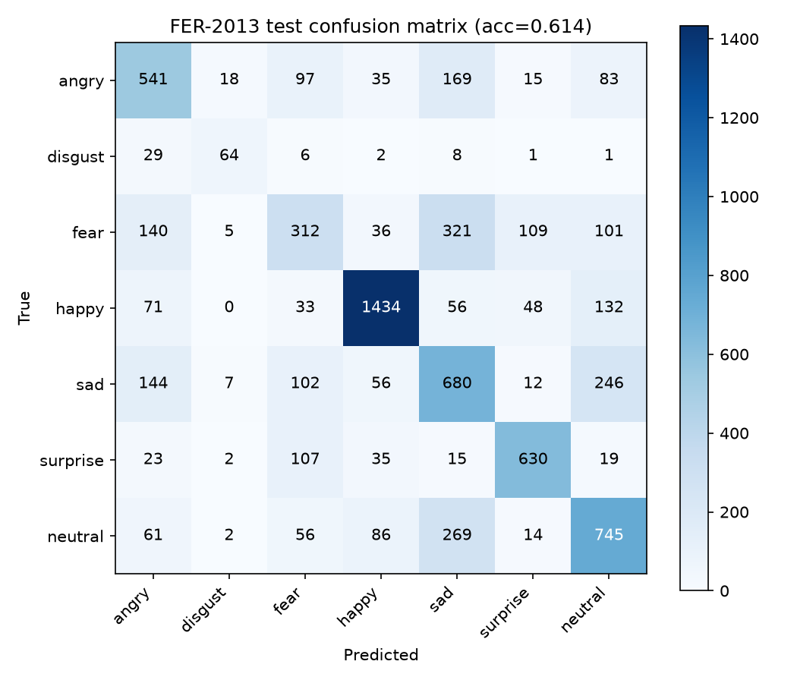
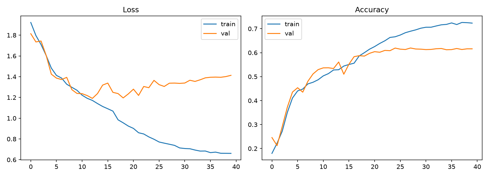

# Facial Emotion Recognition

Classifies a face image (webcam capture or upload) into one of 7 emotions —
angry, disgust, fear, happy, sad, surprise, neutral — using a small CNN
**trained from scratch** on FER-2013.

## Data

[FER-2013](https://huggingface.co/datasets/Jeneral/fer-2013): 35,887 labeled
grayscale 48×48 face images (28,709 train / 7,178 test), collected from
real-world photos and deliberately noisy — low resolution, occlusion,
inconsistent lighting, mislabeled examples. No cleaning or curation was
applied; this is the standard, difficult FER-2013 split.

| split | angry | disgust | fear | happy | sad | surprise | neutral |
|---|---|---|---|---|---|---|---|
| train | 3,995 | 436 | 4,097 | 7,215 | 4,830 | 3,171 | 4,965 |
| test | 958 | 111 | 1,024 | 1,774 | 1,247 | 831 | 1,233 |

`disgust` has ~18x fewer samples than `happy` — handled with class-weighted
cross-entropy loss during training, not by discarding the imbalance.

## Model

A CNN trained **from scratch** (no pretrained backbone) — 4 conv blocks
(BatchNorm + ReLU + MaxPool), dropout, 2 FC layers. See `model.py`.

## Results (this run, on this machine)

- **Test accuracy: 61.4%** on the untouched FER-2013 test split (7,178 images)
- Published baselines for FER-2013 land around 65-70% test accuracy with
  similarly-sized CNNs — this run is in that range, on the honest end of it.
- Device: Apple M1 Pro (MPS), 40 epochs, ~531s training time.

Per-class precision / recall / F1:

| class | precision | recall | f1 | support |
|---|---|---|---|---|
| angry | 0.54 | 0.56 | 0.55 | 958 |
| disgust | 0.65 | 0.58 | 0.61 | 111 |
| fear | 0.44 | 0.30 | 0.36 | 1024 |
| happy | 0.85 | 0.81 | 0.83 | 1774 |
| sad | 0.45 | 0.55 | 0.49 | 1247 |
| surprise | 0.76 | 0.76 | 0.76 | 831 |
| neutral | 0.56 | 0.60 | 0.58 | 1233 |

`fear` is the weakest class by a wide margin (recall 0.30). The confusion
matrix below shows why: FER-2013 is notorious for confusing **fear and
sad**, and this run reproduces that exactly — 321 of 1,024 fear images are
misclassified as sad, and sad itself scatters across angry/fear/neutral.
Rather than hide this, it's the headline finding of the confusion matrix.




## App

`app.py` (Streamlit) — upload a photo or use the webcam. A Haar-cascade face
detector (bundled with OpenCV) crops the face to 48×48, and the app shows a
**confidence bar for all 7 classes**, not just the top-1 label. A live-webcam
mode averages predictions over the last 10 frames to smooth flicker instead
of showing noisy per-frame flips.

## Reproduce

```bash
python3 prepare_data.py   # unpacks data/raw/{train,test}.pt into numpy arrays
python3 train.py          # trains best_model.pt, writes history.json
python3 evaluate.py       # test accuracy, confusion matrix, curves
streamlit run app.py
```
